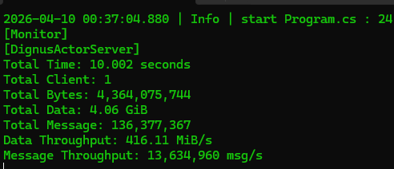
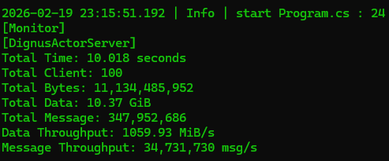
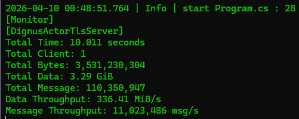
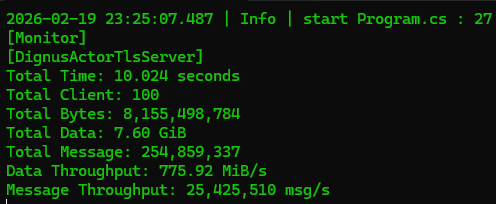

# Dignus.ActorServer

[](https://www.nuget.org/packages/Dignus.ActorServer/)

High-performance Actor-based network server framework.

---

## Performance

### Benchmark Environment
- CPU: Intel Core i5-12400F (12th Gen)
- Cores / Threads: 6 / 12
- Max Turbo Frequency: 4.40 GHz
- Memory: 32 GB
- Architecture: x64
- Operating System: Windows 64-bit
- Runtime: .NET 8 (Release x64)

### Round-Trip Benchmark (Plain TCP)

This benchmark measures full round-trip throughput:

Client send -> Server-side processing -> Response return

<p align="center">
  
</p>

### Test Conditions

- Server address: 127.0.0.1
- Server port: 5000
- Protocol: Plain TCP (no TLS)
- Working clients: 1
- In-flight messages per client: 1000
- Message size: 32 bytes
- Benchmark duration: 10 seconds

### Result

```
Total Time: 10.008 seconds
Total Client: 1
Total Bytes: 3,269,163,360
Total Data: 3.04 GiB
Total Message: 102,161,355
Data Throughput: 311.53 MiB/s
Message Throughput: 10,208,278 msg/s
```

---

### Multi-Client Round-Trip Benchmark (Plain TCP)

<p align="center">
  
</p>

### Test Conditions

- Server address: 127.0.0.1
- Server port: 5000
- Protocol: Plain TCP (no TLS)
- Working clients: 100
- In-flight messages per client: 1000
- Message size: 32 bytes
- Benchmark duration: 10 seconds

### Result

```
Total Time: 10.018 seconds
Total Client: 100
Total Bytes: 11,134,485,952
Total Data: 10.37 GiB
Total Message: 347,952,686
Data Throughput: 1059.93 MiB/s
Message Throughput: 34,731,730 msg/s
```

---

### TLS Round-Trip Benchmark

<p align="center">
  
</p>

### Test Conditions

- Server address: 127.0.0.1
- Server port: 5000
- Protocol: TLS over TCP
- Working clients: 1
- In-flight messages per client: 1000
- Message size: 32 bytes
- Benchmark duration: 10 seconds

### Result

```
Total Time: 10.002 seconds
Total Client: 1
Total Bytes: 2,482,299,424
Total Data: 2.31 GiB
Total Message: 77,571,857
Data Throughput: 236.68 MiB/s
Message Throughput: 7,755,636 msg/s
```

---

### Multi-Client Round-Trip Benchmark (Tls)

<p align="center">
  
</p>

### Test Conditions

- Server address: 127.0.0.1
- Server port: 5000
- Protocol: TLS over TCP
- Working clients: 100
- In-flight messages per client: 1000
- Message size: 32 bytes
- Benchmark duration: 10 seconds

### Result

```
Total Time: 10.024 seconds
Total Client: 100
Total Bytes: 8,155,498,784
Total Data: 7.60 GiB
Total Message: 254,859,337
Data Throughput: 775.92 MiB/s
Message Throughput: 25,425,510 msg/s
```

---

### Performance Highlights

- Over 10 million round-trip messages per second
- Sustained throughput above 300 MiB/sec
- Full end-to-end measurement (decode -> actor execution -> encode -> send)
- Execution confined to dedicated dispatcher threads
- No ThreadPool scheduling for actor logic

---

## Design Goals

- Strict separation of session logic and network I/O
- Single-threaded execution guarantee per actor
- Partition-based dispatcher scheduling
- Async/await support with dispatcher-context enforcement
- Message-driven concurrency model

---

## Core Architecture

### ActorSystem

`ActorSystem` manages:

- Multiple `ActorDispatcher` instances
- Actor lifecycle
- Partition-based distribution

Actors are distributed using:

```
dispatcherIndex = actorId % dispatcherCount
```

Each actor executes through an `ActorRunner`.

---

### ActorDispatcher

Each dispatcher:

- Owns a dedicated worker thread
- Maintains a lock-free scheduling queue
- Uses SemaphoreSlim for wake-up signaling
- Enforces dispatcher-thread execution context

Guarantees:

- An actor always executes on the same thread
- Async continuations resume on the dispatcher thread
- No ThreadPool execution for actor logic

---

### ActorRunner

Execution engine of an actor.

Responsibilities:

- Mailbox processing
- Lifecycle management
- ValueTask-based async handling
- Continuation rescheduling

Execution model:

1. Dequeue message
2. Execute OnReceive
3. If async incomplete -> schedule continuation
4. Resume on dispatcher thread

This guarantees logical single-threaded execution per actor.

---

## Network Layer

```
TcpServerBase / TlsServerBase
    |
    v
ActorPacketProcessor
    |
    v
SessionActor
    |
    v
TransportActor
```

---

## Concurrency Model

- Single-threaded execution per actor
- Dedicated dispatcher threads
- No shared mutable state across actors
- Message-passing communication model
- Lock-free mailbox scheduling

---

## Lifecycle Model

Kill flow:

1. sessionRef.Kill()
2. ActorRunner transitions to killing state
3. Finalization executed on dispatcher thread
4. Mailbox cleared
5. Actor removed from ActorSystem
6. TransportActor disposes underlying session
