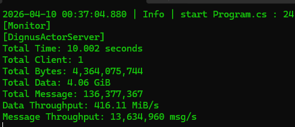
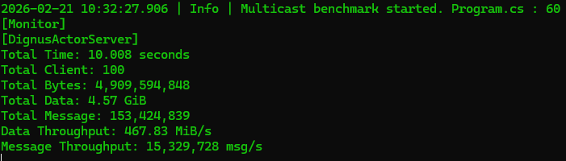
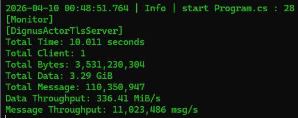
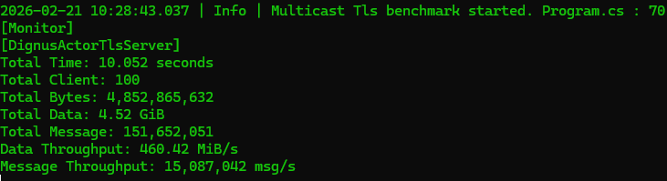

# Dignus.ActorServer

[](https://www.nuget.org/packages/Dignus.ActorServer/)

High-performance Actor-based network server framework.

---

## Performance

### Benchmark Environment
- CPU: Intel Core i5-12400F (12th Gen)
- Cores / Threads: 6 / 12
- Max Turbo Frequency: 4.40 GHz
- Memory: 32 GB
- Architecture: x64
- Operating System: Windows 64-bit
- Runtime: .NET 10 (Release x64)

### Round-Trip Benchmark (Plain TCP)

This benchmark measures full round-trip throughput:

Client send -> Server-side processing -> Response return

<p align="center">
  
</p>

### Test Conditions

- Server address: 127.0.0.1
- Server port: 5000
- Protocol: Plain TCP (no TLS)
- Working clients: 1
- In-flight messages per client: 1000
- Message size: 32 bytes
- Benchmark duration: 10 seconds

### Result

```
Total Time: 10.008 seconds
Total Client: 1
Total Bytes: 3,269,163,360
Total Data: 3.04 GiB
Total Message: 102,161,355
Data Throughput: 311.53 MiB/s
Message Throughput: 10,208,278 msg/s
```

---

### TCP Fan-out Benchmark (100 clients)

Send pattern: Server broadcasts identical payload to all connected clients

<p align="center">
  
</p>

### Test Conditions

- Server address: 127.0.0.1
- Server port: 5000
- Protocol: Plain TCP (no TLS)
- Working clients: 100
- Message size: 32 bytes
- Benchmark duration: 10 seconds

### Result

```
Total Time: 10.008 seconds
Total Client: 100
Total Bytes: 4,909,594,848
Total Data: 4.57 GiB
Total Message: 153,424,839
Data Throughput: 467.83 MiB/s
Message Throughput: 15,329,728 msg/s
```

---

### TLS Round-Trip Benchmark

This benchmark measures full round-trip throughput:

Client send -> Server-side processing -> Response return

<p align="center">
  
</p>

### Test Conditions

- Server address: 127.0.0.1
- Server port: 5000
- Protocol: TLS over TCP
- Working clients: 1
- In-flight messages per client: 1000
- Message size: 32 bytes
- Benchmark duration: 10 seconds

### Result

```
Total Time: 10.002 seconds
Total Client: 1
Total Bytes: 2,482,299,424
Total Data: 2.31 GiB
Total Message: 77,571,857
Data Throughput: 236.68 MiB/s
Message Throughput: 7,755,636 msg/s
```

---

### Tls Fan-out Benchmark (100 clients)

Send pattern: Server broadcasts identical payload to all connected clients

<p align="center">
  
</p>

### Test Conditions

- Server address: 127.0.0.1
- Server port: 5000
- Protocol: TLS over TCP
- Working clients: 100
- Message size: 32 bytes
- Benchmark duration: 10 seconds

### Result

```
Total Time: 10.052 seconds
Total Client: 100
Total Bytes: 4,852,865,632
Total Data: 4.52 GiB
Total Message: 151,652,051
Data Throughput: 460.42 MiB/s
Message Throughput: 15,087,042 msg/s
```

---

### Performance Highlights

- Over 10 million round-trip messages per second
- Sustained throughput above 300 MiB/sec
- Full end-to-end measurement (decode -> actor execution -> encode -> send)
- Execution confined to dedicated dispatcher threads
- No ThreadPool scheduling for actor logic

---

## Design Goals

- Strict separation of session logic and network I/O
- Single-threaded execution guarantee per actor
- Partition-based dispatcher scheduling
- Async/await support with dispatcher-context enforcement
- Message-driven concurrency model

---

## Core Architecture

### ActorSystem

`ActorSystem` manages:

- Multiple `ActorDispatcher` instances
- Actor lifecycle
- Partition-based distribution

Actors are distributed using:

```
dispatcherIndex = actorId % dispatcherCount
```

Each actor executes through an `ActorRunner`.

---

### ActorDispatcher

Each dispatcher:

- Owns a dedicated worker thread
- Maintains a lock-free scheduling queue
- Uses SemaphoreSlim for wake-up signaling
- Enforces dispatcher-thread execution context

Guarantees:

- An actor always executes on the same thread
- Async continuations resume on the dispatcher thread
- No ThreadPool execution for actor logic

---

### ActorRunner

Execution engine of an actor.

Responsibilities:

- Mailbox processing
- Lifecycle management
- ValueTask-based async handling
- Continuation rescheduling

Execution model:

1. Dequeue message
2. Execute OnReceive
3. If async incomplete -> schedule continuation
4. Resume on dispatcher thread

This guarantees logical single-threaded execution per actor.

---

## Network Layer

```
TcpServerBase / TlsServerBase
    |
    v
ActorPacketProcessor
    |
    v
SessionActor
    |
    v
Actor
```

---

## Concurrency Model

- Single-threaded execution per actor
- Dedicated dispatcher threads
- No shared mutable state across actors
- Message-passing communication model
- Lock-free mailbox scheduling

---

## Lifecycle Model

Kill flow:

1. sessionRef.Kill()
2. ActorRunner transitions to killing state
3. Finalization executed on dispatcher thread
4. Mailbox cleared
5. Actor removed from ActorSystem
6. TransportActor disposes underlying session

# Protocol Model (Recommended)

Dignus.ActorServer uses a **handler-less protocol model by default**.

- No protocol handlers  
- No pipeline required  
- Direct message dispatch to actor  

---

## Protocol Definition

```csharp
using Dignus.Actor.Network.Attributes;

internal class EchoMessage : IActorMessage
{
}
```

---

## Registration (Startup)

```csharp
Singleton<ProtocolBodyTypeMapper>.Instance.AddMapping<EchoMessage>(CSProtocol.EchoMessage);
```

---

### Custom Registration Pattern

For larger projects, you can build your own registration layer on top of it.

For example, using extension methods:

```csharp
public static class ProtocolMappingExtensions
{
    public static void RegisterGameProtocols(this ProtocolBodyTypeMapper mapper)
    {
        mapper.AddMapping<Login>(CSProtocol.Login);
        mapper.AddMapping<Logout>(CSProtocol.Logout);
        mapper.AddMapping<GetRoomList>(CSProtocol.GetRoomList);
    }
}
```

Usage:

```csharp
Singleton<ProtocolBodyTypeMapper>.Instance.RegisterGameProtocols();
```

You can also implement automatic registration using:

- attributes
- assembly scanning
- naming conventions

This approach keeps the framework simple while allowing each server to define its own mapping strategy.

## Decode (Network Layer)

```csharp
public IActorMessage Deserialize(ReadOnlySpan<byte> packet)
{
    int protocol = BitConverter.ToUInt16(packet[..2]);

    var mapper = Singleton<ProtocolBodyTypeMapper>.Instance;

    if (!mapper.ValidateProtocol(protocol))
    {
        return null;
    }

    var bodyType = mapper.GetBodyType(protocol);

    return (IActorMessage)JsonSerializer.Deserialize(
        packet.Slice(2),
        bodyType
    );
}
```

---

## Actor Execution

```csharp
protected override async ValueTask OnReceive(IActorMessage message, IActorRef sender)
{
    if (message is EchoMessage echo)
    {
        // handle message
    }
}
```

---

## Execution Flow

```
TCP Packet
    ↓
Protocol Extract
    ↓
BodyType Resolve
    ↓
Deserialize
    ↓
Actor Message
    ↓
Mailbox Post
    ↓
Actor.OnReceive
```

---

## Why This Model

- No reflection-based handler binding  
- No pipeline overhead  
- No additional execution hop  
- Lower latency  
- Simple and predictable structure  

---

# Protocol Pipeline (Advanced)

`Dignus.ActorServer` provides an optional protocol pipeline for advanced scenarios.

This feature introduces an additional execution step and allows composing middleware
into the protocol execution flow.

---

## When to Use Pipeline

Use the protocol pipeline when you need:

- Middleware (authentication, validation, logging)
- Custom execution flow per protocol
- Extensible and composable processing structure

---

## Pipeline Overview

The pipeline enables chaining multiple middleware components before reaching the final handler.

```
Protocol → Middleware → Middleware → Handler → Actor
```

Each middleware can:

- Inspect or modify the request
- Execute logic before or after the next step
- Short-circuit execution if needed

---

## Registration Phase

At startup, protocol handlers are scanned and bound to the pipeline.

```
ActorProtocolPipeline.Register<TProtocol>()
    ↓
Protocol method scan
    ↓
Body type extraction
    ↓
Middleware registration
    ↓
Delegate compilation
```

### Example

```csharp
ActorProtocolPipeline<ClientPipelineContext>.Register<CLSProtocol>((method, pipeline) =>
{
    var filters = method.GetCustomAttributes<ActionAttribute>();
    var orderedFilters = filters.OrderBy(r => r.Order).ToList();

    var middleware = new ProtocolActionMiddleware(orderedFilters);

    pipeline.Use(middleware);
});
```

---

## Runtime Execution

When a packet is received:

```
TCP Packet
    ↓
Deserialize
    ↓
Protocol Resolve
    ↓
Create Context
    ↓
Pipeline Execution
    ↓
Middleware Chain
    ↓
Handler Execution
    ↓
Actor Logic
```

---

## Decode Example

```csharp
public IActorMessage Deserialize(ReadOnlySpan<byte> packet)
{
    int protocol = BitConverter.ToUInt16(packet[..ProtocolSize]);

    if (!ActorProtocolPipeline<ClientPipelineContext>.ValidateProtocol(protocol))
    {
        return null;
    }

    var bodyType = ActorProtocolPipeline<ClientPipelineContext>.GetBodyType(protocol);

    var body = JsonSerializer.Deserialize(packet[ProtocolSize..], bodyType);

    async Task lambda(PlayerActor actor)
    {
        var context = new ClientPipelineContext
        {
            Protocol = protocol,
            Body = body,
            State = actor
        };

        await ActorProtocolPipeline<ClientPipelineContext>.ExecuteAsync(ref context);
    }

    return new InBoundLambdaMessage(lambda);
}
```

---

## Characteristics

- Middleware can be composed freely
- Execution flow can be customized per protocol
- Supports cross-cutting concerns (auth, logging, validation)
- Adds one additional execution step compared to the default model

---

## Comparison

```
Default (Recommended):
    Protocol → BodyType → Deserialize → Actor

Pipeline (Advanced):
    Protocol → Middleware → Handler → Actor
```

---

## Summary

Use pipeline only when you need control over execution flow.

For most cases, the direct message model is simpler and sufficient.